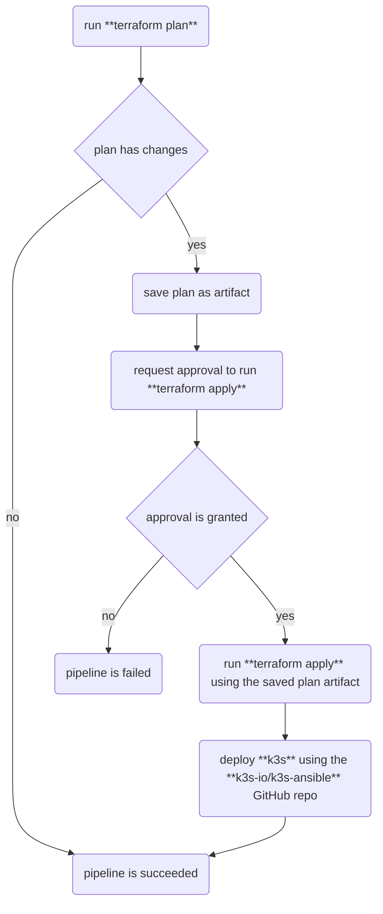

# infra

## Background

This repo hosts IaC & other automation required to set up "Soda City" -- the nickname for my cloud homelab. Currently, the main purpose of this homelab is to serve as a personal gym for practicing Terraform and Kubernetes (1) from anywhere, and (2) without needing to manage my own hardware.

At this point of time, Soda City is constituted of the following:

- 3 `cpx11` Hetzner VMs running in their `ash` data center.
- K3s running on those VMs in a 1-`server`, 2-`agent` configuration (not HA yet, I know -- plan to enable this at some point).

This environment is very minimal. However, since the provisioning of this setup is fully managed by Terraform, the idea is to be able to easily scale this environment as needed in the future through code -- from adding more `k3s` nodes, to moving to another cloud, and anything in between.

## Automation Pipeline

The heavy lifting of this repo is occurring wihin the [infra-deploy.yml GitHub Actions Workflow](.github/workflows/infra-deploy.yml). The below diagram describes this pipeline at a high level:



This pipeline works for now since I am currently the sole maintainer of this repo (and am thus only committing to the `main` branch). Should this project ever become collaborative, I would need to consider how to update this pipeline to accommodate a branch-based workflow:

- Right now, this pipeline gets triggered manually, whenever I need to push any updates. With multiple collaborators, it would make sense to have these steps trigger automatically any time there is a **pull request** into `main`.
- The benefit of this approach is `main` would be guaranteed to reflect the exact state of the infrastructure at any point in time.
- However, to guarantee this, there can only be **1 active PR** into `main` at a time, to avoid conflicting `terraform apply`'s on different PRs.
- There are tools out there like [Atlantis](https://www.runatlantis.io/) that [can supposedly help mitigate that issue](https://www.reddit.com/r/Terraform/comments/145b98o/comment/jnkzih5/?utm_source=share&utm_medium=web3x&utm_name=web3xcss&utm_term=1&utm_content=share_button).
- However, the tradeoff here is that Atlantis requires an instance of itself to be spun up & running somewhere, which is one more thing to maintain at the end of the day.

## Development Runbook

### Manual Provisioning and Deployment

To reproduce this automation locally, the following steps can be taken:

0. The starting point for developing this automation locally is to install Terraform in your local environment. [Hashicorp's documentation](https://developer.hashicorp.com/terraform/tutorials/aws-get-started/install-cli) should be followed in order to do this.

1. An S3 bucket also needs to exist somewhere to store the Terraform state. This particular automation is accomplishing this with [DigitalOcean Spaces](https://docs.digitalocean.com/products/spaces/reference/terraform-backend/), but any S3-compatible object storage can be used here.

2. A Hetzner Cloud API token should be generated for a Hetzner Cloud project. Details on how to do this are specified within [Hetzner's documentation](https://docs.hetzner.com/cloud/api/getting-started/generating-api-token/).

3. An SSH key pair that would be used to log in to the Hetzner VMs provisioned by Terraform should then be generated. A helpful guide on how to do this can be referred to [here](https://www.ssh.com/academy/ssh/keygen#creating-an-ssh-key-pair-for-user-authentication). Hold on to the **public** portion of this key pair for later.

4. Clone this repository & `cd` locally to where you have cloned it. Here, create a file called `terraform.tfvars` at the root, replacing everything within & including the `<>` angle brackets with the relevant items from steps 2 & 3:

    ```sh
    cat <<EOF >> terraform.tfvars
    hcloud_api_token = "<your Hetzner project's API token>"
    vm_ssh_key = "<the public portion of your SSH key pair>"
    EOF
    ```

5. Terraform can now be initialized as so:

    ```sh
    export AWS_ACCESS_KEY_ID=       # your S3 bucket's AWS access key ID
    export AWS_SECRET_ACCESS_KEY=   # your S3 bucket's secret access key
    terraform init
    ```

    The infrastructure can be provisioned by running:

    ```sh
    terraform apply
    ```

    If needed later on, everything can also be spun down via:

    ```sh
    terraform destroy
    ```

6. After running `terraform apply`, the public IP addresses of the newly provisioned VMs can be collected using `terraform output`, for example:

    ```sh
    terraform output
    #   hcloud_vm_ipv4s = tolist([
    #       "10.1.1.1",
    #       "10.1.1.2",
    #       "10.1.1.3",
    #   ])
    ```

7. K3s can be deployed onto these VMs using the Ansible playbooks provided in the [`k3s-io/k3s-ansible` repo](https://github.com/k3s-io/k3s-ansible#usage). Clone the repo somewhere else in your development environment, `cd` into it, and create an inventory file at the root using the IP addresses you got in the last step:

    ```sh
    cat <<EOF >> inventory.yml
    k3s_cluster:
        vars:
            ansible_port: 22
            ansible_user: soda
            k3s_version: v1.30.2+k3s1
            api_endpoint: "{{hostvars[groups.server[0]].ansible_host|default(groups.server[0])}}"
        children:
            server:
                hosts:
                    10.1.1.1:
            agent:
                hosts:
                    10.1.1.2:
                    10.1.1.3:
    EOF
    ```

8. As specified in the documentation, ensure you have at least version 2.15 of `ansible-core` installed. On Ubuntu 24.04.1, this can easily be done via `apt`:

    ```sh
    sudo apt update
    sudo apt install ansible -y
    ```

9. Before running the playbook, the **private** portion of this SSH key pair should be configured using `ssh-agent` [as described in the Ansible docs](https://docs.ansible.com/ansible/latest/inventory_guide/connection_details.html#setting-up-ssh-keys). Once this is done, run the Ansible playbook to deploy K3s using the inventory file created in step 7:

    ```sh
    ansible-playbook playbooks/site.yml -i inventory.yml
    ```

### Cluster Management

An already deployed instance of the K3s cluster can be interacted with from a local development environment as follows:

0. Ensure `kubectl` is installed as per [the official Kubernetes documentation](https://kubernetes.io/docs/tasks/tools/install-kubectl-linux/).

1. Pull the cluster's kubeconfig file from the cluster's `server` node. This can be ascertained from the logs of the `k3s_deploy` job of the [infra-deploy.yml GitHub Actions Workflow](.github/workflows/infra-deploy.yml) if the cluster was provisioned using this repo's automation. Using the example `inventory.yml` file from the previous section:

    ```sh
    ssh -i ~/.ssh/sodacity -o StrictHostKeyChecking=no -o UserKnownHostsFile=/dev/null soda@10.1.1.1    # replace 10.1.1.1 with the server node's IP

    # on server node
    sudo cp /etc/rancher/k3s/k3s.yaml .
    sudo chown soda k3s.yaml
    exit

    # back on local
    mkdir -p ~/.kube
    scp -i ~/.ssh/sodacity -o StrictHostKeyChecking=no -o UserKnownHostsFile=/dev/null soda@10.1.1.1:~/k3s.yaml ~/.kube/config
    chmod 600 ~/.kube/config
    sed -i -e "s/127.0.0.1/10.1.1.1/g" ~/.kube/config
    ```

2. Ensure the cluster can be interacted with:

    ```sh
    kubectl get nodes
    #   NAME                            STATUS   ROLES                  AGE   VERSION
    #   sodacity-ash-vm-clean-raccoon   Ready    control-plane,master   1m   v1.30.2+k3s1
    #   sodacity-ash-vm-funky-tiger     Ready    <none>                 1m   v1.30.2+k3s1
    #   sodacity-ash-vm-main-spaniel    Ready    <none>                 1m   v1.30.2+k3s1
    ```

3. Ensure `helm` is installed as per [its documentation](https://helm.sh/docs/intro/install/). For some basic monitoring, Grafana & Prometheus can be installed to a dedicated namespace called `monitoring` as follows:

    ```sh
    helm repo add prometheus-community https://prometheus-community.github.io/helm-charts
    helm repo update
    helm install prometheus prometheus-community/kube-prometheus-stack --namespace monitoring --create-namespace
    ```

    The Grafana dashboard can then be accessed within the local development environment as follows:

    ```sh
    kubectl proxy
    #   Starting to serve on 127.0.0.1:8001

    # in a parallel terminal window
    kubectl port-forward -n monitoring svc/prometheus-grafana :80
    #   Forwarding from 127.0.0.1:38591 -> 3000
    #   Forwarding from [::1]:38591 -> 3000
    ```

## To Do's

Below is a list of things I want to do next with this setup. This section will be getting updated as work items are completed & more work items are added. These are not necessary organized by priority:

- [ ] Make the K3s cluster HA
- [ ] Automatically deploy required Helm charts as part of the automation pipeline
- [ ] Build a basic REST API for something & deploy to it to this cluster
- [ ] Evaluate GitOps solutions (either [Argo CD](https://argo-cd.readthedocs.io/en/stable/) or [Flux CD](https://fluxcd.io/))
- [ ] Configure email alerts (for node CPU usage, etc.) from Prometheus
